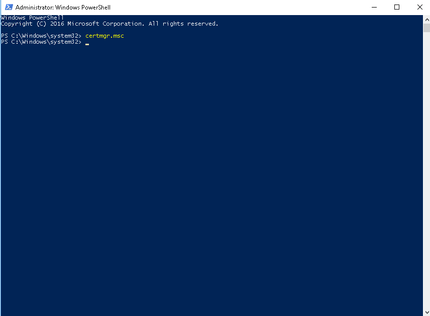

<h1 align="center">
LDAP Reset Password - Focused Active Directory
</h1>

<p align="center">
This project can be used to reset a user's password in an LDAP server. We utilize Python and the LDAP protocol to manage users in the Directory Server.
</p>

<p align="center">


    <br>


</p>


# Overview

 * <strong><a href="#configurations">Configurations</a></strong>
    * <strong><a href="#active-directory">Active Directory</a></strong>
    * <strong><a href="#export-ad-certificate">Export AD certificate</a></strong>
    * <strong><a href="#linux-server">Linux Server</a></strong>
        * <strong><a href="#test-ldap-connection">Test LDAP Connection</a></strong>
        * <strong><a href="#add-active-directory-in-our-linux-server">Add Active Directory in our linux server</a></strong>
 * <strong><a href="#run-application">Run Application</a></strong>
    * <strong><a href="#python-configurations">Python configurations</a></strong>
    * <strong><a href="#enviroments">Enviroments</a></strong>
        * <strong><a href="#dev-settings">Dev settings</a></strong>
        * <strong><a href="#production-settings">Production settings</a></strong>


<h1 id="configurations">Configurations</h1>

<h2 id="active-directory">Active Directory</h2>

To deploy this project, you will need an Active Directory (AD) server to connect with the LDAP Reset Password functionality. Therefore, your first step is to configure your AD server.

AD use various security protocols to update user data. For instance, it is essential to use the secure port (port 636) for LDAP connections, as the insecure port (port 389) should only be used for reading data.

We need to export the AD certificate and import it into your application server. Below, I will show you how to accomplish this.

<h2 id="export-ad-certificate">Export AD certificate</h2>

1. Go to your Active Directory server;
2. Open PowerShell as Administrator;
3. Run **certmgr.msc** to open certificate list;



4. To Navigate for certificate list, click in **Trusted Toot Certification Authorities** > **Certificates**;
5. Select the certificate with same name from your AD server and click with right buttom from mouse;
6. Click in **All Tasks** > **Export**;


7. Select the **Base-64 encoded X.509 (.CER)** and click next;


8. Select a diretory to save and click next;


9. Click Finish.


<h2 id="linux-server">Linux Server</h2>

Now you have an Active Directory certificate to use in your Linux server. In my case, I am using Ubuntu 22.04.

<h3 id="test-ldap-connection">Test LDAP Connection</h3>

I am using the command below to test the Active Directory connection.

Please run the LDAP search test on your Linux server. The test is considered successful if it returns a list of users.

```shell
# Without security port
ldapsearch -H ldap://192.168.0.54:389 -D 'CN=Test AD,OU=development,OU=enterprise,DC=adtest,DC=org' -w 9a2@a99c9499 -b "dc=adtest,dc=org" -s sub "(objectClass=user)" givenName

# With security port
ldapsearch -H ldaps://192.168.0.54:636 -D 'CN=Test AD,OU=development,OU=enterprise,DC=adtest,DC=org' -w 9a2@a99c9499 -b "dc=adtest,dc=org" -s sub "(objectClass=user)" givenName

-H -> LDAP Uniform Resource Identifier(s)
-D -> bind DN
-w -> bind password (for simple authentication)
-b -> base dn for search
-s -> one of base, one, sub or children (search scope)
```

Obs: For your first test, you may observe that the LDAP connection on the insecure port is functioning correctly. However, you might encounter an error when attempting to connect through the secure port. To resolve this issue, we need to import the Active Directory certificate into our Linux server. Let's proceed with the certificate importation now.

<h3 id="add-active-directory-in-our-linux-server">Add Active Directory in our linux server</h3>

As an example, let's assume you have the LDAP-Test.cer file created during the Export AD Certificate step. You can place this file in the /Documents/certs folder on your Linux server.

The following steps demonstrate how to add a certificate file to the "certificates" folder on a Linux system:

1. Open a terminal;
2. Navigate to the directory where the certificate file is located (/Documents/certs/ in my documents);
3. Run **sudo cp LDAP-TEST.cer /etc/ssl/certs** to copy certificate to /etc/ssl/certs;
4. Run **sudo update-ca-certificates -f** to update linux certificates.

Now you need to update the LDAP configuration on your server to load the LDAP-TEST.cer certificate. You can follow the steps below to accomplish this:

1. Run **sudo nano /etc/ldap/ldap.conf** to edit the ldap.conf
2. Add the attributes TLS_REQCERT, TLS_CACERT and TLS_CACERTDIR.

```
# /etc/ldap/ldap.conf
-----------------------------------------------------
# TLS certificates (needed for GnuTLS)
TLS_CACERT      /etc/ssl/certs/ca-certificates.crt

TLS_REQCERT never
TLS_CACERT /etc/ssl/certs/LDAP-TEST.cer
TLS_CACERTDIR /etc/ssl/certs
```

***Done server configuration***


<h1 id="run-application">Run Application</h1>

This section show how to run the project, the project has two settings (dev and prod), if you want development some feature or modify current code you can use the dev settings, if you want run the production project version you can use the prod configuration.

<h2 id="python-configurations">Python configurations</h2>

This project use the Python=3.10.6

```bash
(venv) ╭─pedro@PC441 ~/Projects/ldap-reset-password/ldap_password ‹main› 
╰─$ python --version 
Python 3.10.6
```

<h2 id="enviroments">Enviroments</h2>

The enviroments file it's used to run the dev and production settings, therefore, before to try run the project you need configure **.env** file, use the **.env.example** to create **.env** file.

<h3 id="dev-settings">Dev settings</h3>

The dev settings has the SQLite as default database and use the DEBUG=True propertie, [django-environ](https://pypi.org/project/django-environ/) is the lib used to load enviroments from .env file.

```python
# Envoiroments load
env = environ.Env()
environ.Env.read_env(".env")

# General settings
SECRET_KEY = env("APP_SECRET_KEY")
DEBUG = True

# Database
DATABASES = {
    "default": {
        "ENGINE": "django.db.backends.sqlite3",
        "NAME": os.path.join(BASE_DIR, "../db.sqlite3"),
        "TEST": {
            "NAME": os.path.join(BASE_DIR, "test_database.sqlite3"),
        },
    }
}

# App metadata
ENTERPRISE_NAME = env("ENTERPRISE_NAME")

# AD Connection details
LDAP_URL = env("LDAP_URL")
LDAP_PORT = int(env("LDAP_PORT"))
LDAP_BASE = env("LDAP_BASE")
LDAP_DOMAIN = env("LDAP_DOMAIN")
LDAP_LOGON_DOMAIN_NAME = env("LDAP_LOGON_DOMAIN_NAME")
LDAP_SERVICE_BIND_DN = env("LDAP_SERVICE_BIND_DN")
LDAP_SERVICE_SAM_ACCOUNT_NAME = env("LDAP_SERVICE_SAM_ACCOUNT_NAME")
LDAP_SERVICE_PASSWORD = env("LDAP_SERVICE_PASSWORD")

# Mail
EMAIL_HOST = env("EMAIL_HOST")
EMAIL_PORT = int(env("EMAIL_PORT"))
DEFAULT_FROM_EMAIL = env("EMAIL_DEFAULT_FROM")
EMAIL_HOST_USER = env("EMAIL_HOST_USER")
EMAIL_HOST_PASSWORD = env("EMAIL_HOST_PASSWORD")
```

Use the commands below to run dev version project.

```bash
# Create virtual env folder
python3 -m venv venv/

# Activate virtual env
source venv/bin/activate

# Verify migrations
python manage.py makemigrations --settings=ldap_password.settings.dev
python manage.py migrate --settings=ldap_password.settings.dev

# Run project
python manage.py runserver --settings=ldap_password.settings.dev
```

<h3 id="production-settings">Production settings</h3>

The dev settings it's configured to run based in docker, has the Postgres as default database and use the DEBUG=False propertie, .env are loaded based in python lib named **os**.


```bash
# Docker need be instaled to run production settings
docker compose up

# Verify migrations
docker compose exec web python manage.py makemigrations --settings=ldap_password.settings.prod
docker compose exec web python manage.py migrate --settings=ldap_password.settings.prod
```

```python
from ldap_password.settings.base import *
import os

# Sobrescrever as configurações base aqui
SECRET_KEY = os.environ.get("APP_SECRET_KEY")
DEBUG = True

DATABASES = {
    "default": {
        "ENGINE": "django.db.backends.postgresql",
        "NAME": os.environ.get("POSTGRES_NAME"),
        "USER": os.environ.get("POSTGRES_USER"),
        "PASSWORD": os.environ.get("POSTGRES_PASSWORD"),
        "HOST": "db",
        "PORT": int(os.environ.get("POSTGRES_port") or "5432"),
    }
}

# App metadata
ENTERPRISE_NAME = os.environ.get("ENTERPRISE_NAME")

# AD Connection details
LDAP_URL = os.environ.get("LDAP_URL")
LDAP_PORT = int(os.environ.get("LDAP_PORT") or "636")
LDAP_BASE = os.environ.get("LDAP_BASE")
LDAP_DOMAIN = os.environ.get("LDAP_DOMAIN")
LDAP_LOGON_DOMAIN_NAME = os.environ.get("LDAP_LOGON_DOMAIN_NAME")
LDAP_SERVICE_BIND_DN = os.environ.get("LDAP_SERVICE_BIND_DN")
LDAP_SERVICE_SAM_ACCOUNT_NAME = os.environ.get("LDAP_SERVICE_SAM_ACCOUNT_NAME")
LDAP_SERVICE_PASSWORD = os.environ.get("LDAP_SERVICE_PASSWORD")

# Mail
EMAIL_HOST = os.environ.get("EMAIL_HOST")
EMAIL_PORT = int(os.environ.get("EMAIL_PORT") or "587")
DEFAULT_FROM_EMAIL = os.environ.get("EMAIL_DEFAULT_FROM")
EMAIL_HOST_USER = os.environ.get("EMAIL_HOST_USER")
EMAIL_HOST_PASSWORD = os.environ.get("EMAIL_HOST_PASSWORD")
```
