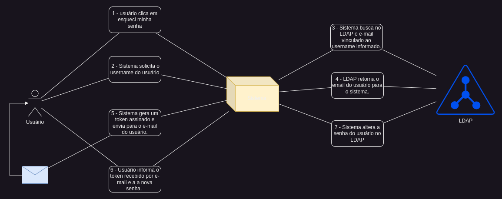

<h1 align="center">LDAP Reset Pass - LDAP-RP</h1>

    This project can be used to reset user password in LDAP server, we use the Python and LDAP protocol to manager users in Directory Server.

## Flow model (Portuguese)

